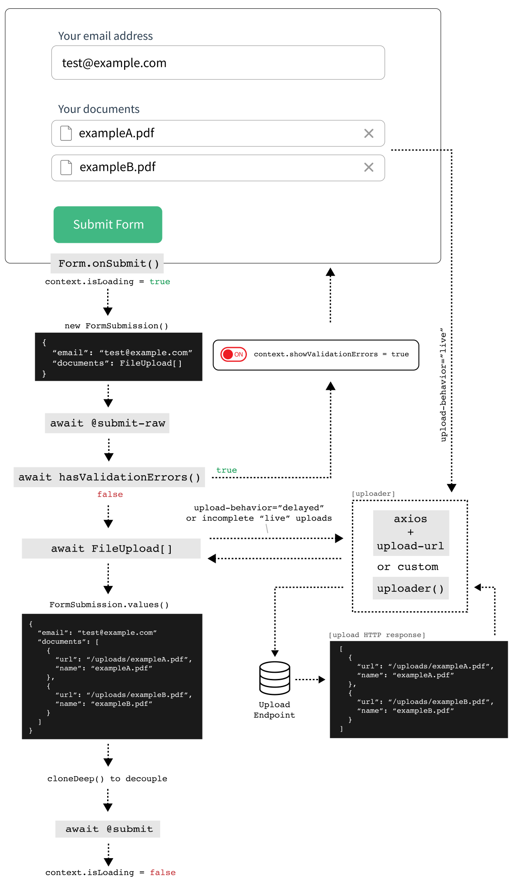

# File

The file [classification](/guide/inputs/custom-inputs/#what-is-a-classification) is given to the following types:

- [file](#file)
- [image](#image)

## File

```vue
<FormulateInput
  type="file"
  name="file"
  label="Select your documents to upload"
  help="Select one or more PDFs to upload"
  validation="mime:application/pdf"
  multiple
/>
```
<demo-file />

## Image

```vue
<FormulateInput
  type="image"
  name="headshot"
  label="Select an image to upload"
  help="Select a png, jpg or gif to upload."
  validation="mime:image/jpeg,image/png,image/gif"
/>
```

<demo-image />

## How it works

File inputs perform their upload function before your
`@submit` handler is called. This is an opinionated approach to reducing
the complexity of building forms across your project(s) by having a single (or small number of)
endpoint that performs the actual upload and storage of the files. This allows
your back end submission handlers to only deal with pure JSON results, and
ensures a clean and concise API for authoring forms on the front end. It also
aligns well with developers who use services like S3, Cloudinary or ImgIX.

::: details Form submission control flow diagram
The following diagram explains the submission flow of a form that includes
file uploads in Vue Formulate.


:::

## Uploader

Inputs in the `file` classification are all used to upload data to a server.
Because of this, they require additional configuration to work
properly. An `uploader` must be defined before `file` inputs are supported.

### Axios

The easiest configuration is to provide an instance of [axios](https://github.com/axios/axios).

```js
import VueFormulate from 'vue-formulate'
import axios from 'axios'

const axiosInstance = axios.create({
  baseURL: 'http://www.your-upload-server.com'
})

Vue.use(VueFormulate, {
  uploader: axiosInstance,
  uploadUrl: '/upload'
})
```

### Custom uploader

If you prefer to roll-your-own upload mechanism, you can provide a function as
the `uploader`. The function will receive 4 arguments:

- `File` object to upload
- `progress` callback, expects `0-100` percentage return value
- `error` callback to call when the upload fails. Accepts a string error message argument.
- `options `Vue Formulate’s configuration object

The `uploader` function must always return a `Promise`. `async`
functions are a good option for doing this automatically.

```js
import VueFormulate from 'vue-formulate'

Vue.use(VueFormulate, {
  uploader: async function (file, progress, error, options) {
    try {
      const formData = new FormData()
      formData.append('file', file)
      const result = await fetch(options.uploadUrl, {
        method: 'POST',
        body: formData
      })
      progress(100) // (native fetch doesn’t support progress updates)
      return await result.json()
    } catch (err) {
      error('Unable to upload file')
    }
  }
})
```

The `uploader` can also be defined directly on a `FormulateInput` instance:

```vue
<template>
  <FormulateInput
    type="file"
    :uploader="uploadFile"
  />
</template>

<script>
export default {
  methods: {
    async uploadFile (file, progress, error, option) {
      // ... perform upload
    }
  }
}
</script>
```

The result from the server should be a simple JSON array of objects in the format:

```json
[{
  "url": "/absolute/path/to/filename.png"
}]
```

While each result can certainly include more details than the `url` property, it
is the only required value. It can be a fully qualified URL or a path. If it's
an `image` it should work as the `src` attribute for an `` tag.

:::tip Note
If you prefer to use a different property than `url` you can change that by
setting the `fileUrlKey` option when registering Vue Formulate.
:::

### Faux uploader

Vue Formulate ships with a fake uploader function that advances the progress
bar but performs no requests. This is helpful for scaffolding and theming, but
it must be replaced for uploads to work.

If dont need uploading at all (you're processing elsewhere) you can disable
the fake uploader by replacing it with a dummy function:

```js
Vue.use(VueFormulate, {
  uploader: function (file, progress) {
    // optionally handle the `file` for your own purposes here...
    progress(100)
    return Promise.resolve({})
  }
})
```

## Setting initial values

Setting the initial value of a form that contains an uploaded file is as simple
as giving it an array of objects containing urls. This will populate the
form element, and return the same url in the payload, but wont re-upload.

```vue
<FormulateInput
  type="file"
  :value="[
    {
      url: '/path/to/document.pdf', // url is required
      name: 'employment-offer.pdf' // name is optional
    }
  ]"
/>
```

<demo-input-hydration />

#### Mime types

When setting an initial file value, like the example above the file extension
in the URL is used to re-create the mime type of the file. Vue Formulate
contains a _very_ limited map of extensions to mimes (to keep the package size
small). Typically this doesn't cause any issues, but if you are using the `mime`
[validation rule](/guide/validation/#mime) and the file extension is not
included in the map it may fail validation. You can easily add your own
extensions/mime types to the Vue Formulate instance.

```js
Vue.use(VueFormulate, {
  mimes: {
    mp3: 'audio/mpeg'
  }
})
```

### Upload results with `FormulateForm`

When using a `FormulateForm` a successful submission will perform an upload on
all files in your form which have not already been uploaded
(`upload‑behavior` can be set to `live` or `delayed`). The resulting upload will return the
string path provided by your server.

```vue
<template>
  <FormulateForm
    @submit="sendData"
  >
    <FormulateInput
      type="text"
      name="name"
      label="Your name"
    />
    <FormulateInput
      type="image"
      name="avatar"
      upload-url="/your/upload/directory"
      label="Your avatar"
      upload-behavior="delayed"
    />
    <FormulateInput
      type="submit"
      label="Save profile"
    />
  </FormulateForm>
</template>

<script>
export default {
  methods: {
    async sendData (data) {
      // (in the demo we show the data object at this point)
      // Send data to your server
      await this.$axios.put('/profile', data)
    }
  }
}
</script>
```

The `submit` handler above will be called only after Vue Formulate has uploaded
any `FormUpload` instances (file values) in the form data. Here's an example of
the above code:

<demo-file-form />

::: tip Note
If you prefer to handle the form submission manually you can listen to the
`submit-raw` event on `FormulateForm` which returns an instance of
`FormSubmission`, read more about [FormulateForm](/guide/#forms).
:::

```json
{
  "name": "Jon Doe",
  "avatar": {
    "url": "/your/upload/directory/avatar.jpg"
  }
}
```

### Upload results with `v-model` on `FormulateInput`

If your use case does not call for a full form, you can directly bind to the
`FormulateInput` and upload the file manually:

```vue
<template>
  <div>
    <FormulateInput
      type="file"
      name="document"
      upload-behavior="delayed"
      v-model="document"
    />
    <a
      @click.prevent="uploadFile"
    >
      Upload the file
    </a>
  </div>
</template>

<script>
export default {
  data () {
    return {
      document: false
    }
  },
  methods: {
    async uploadFile () {
      if (this.document) {
        try {
          const path = await this.document.upload()
        } catch (err) {
          alert('Error uploading')
          console.error(err)
        }
      }
    }
  }
}
</script>
```

::: tip Note
If the file has already been uploaded (like when using the default
`upload‑behavior` of `live`) the `FileUpload.upload()` method will not cause a
duplicate upload, but rather return the resolved path.
:::


## Props

File inputs use the [default props](/guide/inputs/#props), as well as the
following classification specific props:

Prop                | Description
--------------------|-----------------------------------------------------------
`accept`            | This is [standard HTML](https://developer.mozilla.org/en-US/docs/Web/HTML/Element/input/file#attr-accept), but helpful when trying to upload files of a certain type.
`add-label`         | The label of the `+ Add File` button, or `false` to disable the add button all together.
`image‑behavior`    | `preview` or `file` - For an input type `image`, the default is `preview` where a thumbnail of the image is shown.
`prevent‑window‑drops` | `true` by default, this prevents the browser from navigating to a file when the user misses the dropzone.
`uploader`          | `function` or [axios instance](https://github.com/axios/axios) - Mechanism used to perform upload. Defaults to the [globally configured](#uploader) instance.
`upload‑behavior`   | `live` or `delayed` - Determines when the file is uploaded. Defaults to `live`, which uploads the file as soon as it is selected.
`upload‑url`        | URL to perform a POST request which overrides the configured default.

## Events

File inputs use the [default events](/guide/inputs/#events), as well as the
following classification specific events:

Event name         | Description
-------------------|------------------------------------------------------------
`file-upload-progress` | Emitted when the [`uploader`](#uploader) updates the progress of a file upload. The payload is a progress integer (`0-100`).
`file-upload-complete` | Emitted when a file has completed it's upload. The payload is the `file` object.
`file-upload-error`    | Emitted when the `error` function of the `uploader` is called during the upload process. The payload is the error itself.
`file-removed`        | Emitted when a file is removed from the `FileList`. Payload is the resulting `FileList`.

## Slots

The `file` classification has some unique slots (and matching [Slot Components](/guide/inputs/slots/#slot-components)):

Slot name         | Description
------------------|-------------------------------------------------------------
`file`            | Responsible for rendering a single file of the file input. When the input type is `multiple` this slot will be rendered multiple times. <br>_The context object in this slot includes a `file` object and a `imagePreview` boolean._

## Custom class keys

In addition to all [global class keys](/guide/theming/#customizing-classes)
following are available:

Key             | Default                          | Description
----------------|----------------------------------|---------------------------------------------------
`uploadArea`    | `.formulate-input-upload-area`   | The dropzone area wrapper for an upload.
`uploadAreaMask`| `.formulate-input-upload-area-mask` | An additional element positioned immediately after the `<input>` used for stylistic reasons.
`files`         | `.formulate-files`               | A wrapper around a list of files.
`file`          | `.formulate-file`                | A single input file.
`fileAdd`       | `.formulate-file-add`            | The `+ Add File` button for `[multiple]` file inputs.
`fileAddInput`  | `.formulate-file-add-input`      | The `+ Add File` `<input>` element (normally hidden).
`fileName`      | `.formulate-file-name`           | The element responsible for outputting the name of the file.
`fileRemove`    | `.formulate-file-remove`         | The element responsible for removing an existing file.
`fileProgress`  | `.formulate-file-progress`       | The outer wrapper for the progress bar.
`fileProgressInner` | `.formulate-file-progress-inner` | The inner progress indicator. Width is automatically set as a percentage of upload completion.
`fileUploadError` | `.formulate-file-upload-error` | The file upload error displayed for each incorrect file.
`fileImagePreview` | `.formulate-file-image-preview` | The wrapper around the `img` preview.
`fileImagePreviewImage` | `.formulate-file-image-preview-image` | The `img` preview element.
