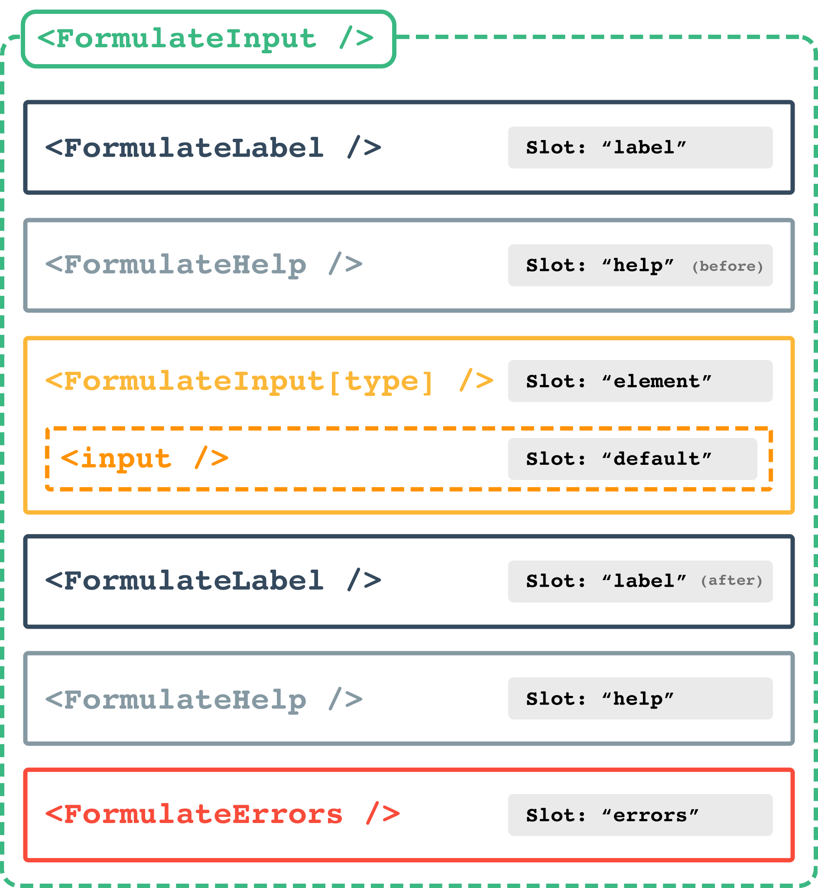

# 自定义表单域类型

如果您要查找的输入类型不是内置字段（主要是 HTML5 input 类型）的一部分，
并且您还没有找到添加所需功能的 [plugin](/zh/guide/plugins)— 您可以创建自己的表单域类型。

### 序言: 表单域的组合方式

Vue Formate 的一个核心概念是让开发人员能够使用极其简单的 API 和单个组件来组合他们的表单。
为了实现这一目标，在开发自定义表单域时，您应该努力通过创建自己类型的来保持跟已有的 `FormulateInput` 具有相同的便利性，
确保即使在使用自定义表单域时创建表单和字段的语法也保持一致。

这与许多大量使用作用域插槽作为主要扩展机制的 Vue 库明显不同。Vue Formulate 也对 [作用域插槽](/zh/guide/inputs/slots/) 有强大的支持，
但这些应该更多地用于偶尔的覆盖而不是整个实用程序的定制。

如果您发现自己对作用域插槽进行了大量复制粘贴，或者包装 `FormulateInput` 在包装器组件中，
则表明您可以更好地实施此原则的一个明显迹象。
如果这些模式正在渗透到您的代码中，请考虑使用 ["插槽组件"](/zh/guide/inputs/slots/#slot-components) 或创建自定义表单域。

## 一个表单域的结构

在深入研究代码之前，让我们从高层次看一下 `FormulateInput` 组件的结构：



## 自定义类型
<div id="custom-types"></div>

让我们处理一个自动完成字段。我们的目标是扩展 Vue Formulate 以允许如下所示的新表单域：

```vue
<FormulateInput
  type="autocomplete"
  name="user"
  label="Search for a user"
  :options="[
    { value: 1, label: 'Jon Doe'},
    { value: 2, label: 'Jane Roe'},
    { value: 3, label: 'Bob Foe'},
    { value: 4, label: 'Ben Cho'},
  ]"
/>
```

为此，我们需要编写一个自定义组件来处理“自动完成”表单域逻辑。
每个 `type` 都被指定为一个组件和一个类型。组件和类型都可以在多个 `type` 中

#### 什么是类型?

类型只是围绕类似表单域的 `type` 对逻辑和样式规则进行分组的一种有用方法，
但仅仅因为您创建了一个新的表单域 type 并不一定意味着您将创建一个新的分组类型。事实上，我们的示例自动完成很适合 text 类型。

#### 什么是表单域组件?

另一个角度讲，表单域组件就是一个 Vue 组件，它传递了一个 [`context` 对象](/zh/guide/inputs/#context-object) prop
（[`context` 对象](/zh/guide/inputs/#context-object) 负责组件的几乎所有功能——熟悉它是个好主意）。
此外，您的自定义表单域可以传递它自定义的 prop 到 slotProps 中. 此自定义组件可用于全新的表单域系统、业务逻辑或自定义 UI 中。

#### model

如果你需要字段验证，表单聚合或 Vue Formulate 的其他优势，这是一个必要条件，
表单的值可以通过 `context.model` 读取，或写入。这是一个绑定到 `<FormulateInput />`
根节点的特殊的 getter/setter 属性

#### 自定义事件
您的自定义组件也可以使用 `context.rootEmit()` 与 `$emit` 在任何其他 Vue 组件上使用的完全相同的方式在 `<FormulateInput>` 根上发出事件。

:::details 查看自动完成的源码
_文件: MyFormulateAutocomplete.vue_
```vue
<template>
  <div
    :class="`formulate-input-element formulate-input-element--${context.type}`"
    :data-type="context.type"
  >
    <input
      type="text"
      v-model="context.model"
      v-bind="context.attributes"
      autocomplete="no"
      @keydown.enter.prevent="context.model = selection.label"
      @keydown.down.prevent="increment"
      @keydown.up.prevent="decrement"
      @blur="context.blurHandler"
    >
    <ul
      v-if="filteredOptions.length"
      class="formulate-input-dropdown"
    >
      <li
        v-for="(option, index) in filteredOptions"
        :key="option.value"
        v-text="option.label"
        :data-is-selected="selection && selection.value === option.value"
        @mouseenter="selectedIndex = index"
        @click="context.model = selection.label"
      />
    </ul>
  </div>
</template>

<script>
export default {
  props: {
    context: {
      type: Object,
      required: true
    },
  },
  data () {
    return {
      selectedIndex: 0
    }
  },
  watch: {
    model () {
      this.selectedIndex = 0
    }
  },
  computed: {
    model () {
      return this.context.model
    },
    selection () {
      if (this.filteredOptions[this.selectedIndex]) {
        return this.filteredOptions[this.selectedIndex]
      }
      return false
    },
    filteredOptions () {
      if (Array.isArray(this.context.options) && this.context.model) {
        const isAlreadySelected = this.context.options.find(option => option.label === this.context.model)
        if (!isAlreadySelected) {
          return this.context.options
            .filter(option => option.label.toLowerCase().includes(this.context.model.toLowerCase()))
        }
      }
      return []
    }
  },
  methods: {
    increment () {
      const length = this.filteredOptions.length
      if (this.selectedIndex + 1 < length) {
        this.selectedIndex++
      } else {
        this.selectedIndex = 0
      }
    },
    decrement () {
      const length = this.filteredOptions.length
      if (this.selectedIndex - 1 >= 0) {
        this.selectedIndex--
      } else {
        this.selectedIndex = length - 1
      }
    }
  }
}
</script>

```
_注意: 在上面的例子中，我们 `<template>` 用一个包含一些 `.formulate-input-element` 类的 
div 来包裹我们的，这不是必需的，但对于主题作者来说，这是一个保持一致的好习惯。_
:::

## 自定义 props

通常，在创建自定义表单域时，您需要传递自定义 prop，例如 url 或去抖动持续时间。
自定义表单域也可以声明他们想直接接收自己的 prop。这是通过在注册期间传递配置参数来完成的。
例如，将 prop 公开给名为 `myinput` 的自定义表单域：

```js
// Vue Formulate config:
{
  library: {
    myinput: {
      classification: 'myclassification',
      component: 'MyFormulateInput',
      slotProps: {
        component: ['url']
      }
    }
  }
}
```

## 注册表单域

编写输入组件后，您需要让 Vue Formulate 知道有一个新 `type  的表单域并且它有一个自定义组件（和/或classification）。
您可以通过扩展 `library` 全局选项来做到这一点。

```js
import Vue from 'vue'
import VueFormulate from '@braid/vue-formulate'
import MyFormulateAutocomplete from './MyFormulateAutocomplete'

// register your component with Vue
Vue.component('MyFormulateAutocomplete', MyFormulateAutocomplete)

Vue.use(VueFormulate, {
  library: {
    autocomplete: {
      classification: 'text',
      component: 'MyFormulateAutocomplete'
    }
  }
})
```

一瞬间！您现在已经扩展了 Vue Formulate 以包含自定义表单域类型。

<demo-custom-input />
