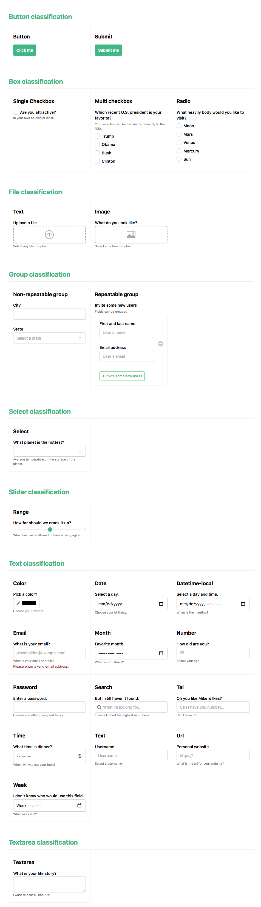

# 主题化

Vue Formulate 与您选择应用于表单域的样式完全无关，
但它有意设计为易于编写样式。Vue Formulate 为主题中的每个主要成分提供功能，包括：

- [自定义 class](/zh/guide/theming/customizing-classes) (从 2.4 开始)
- [更改 DOM 结构](/zh/guide/inputs/slots) (从 2.3 开始)
- [编写自定义样式](/zh/guide/theming/styling-tips)

## 默认主题

默认情况下，该包包含单个主题（名为“snow”）的 SCSS 和已编译的 CSS。
这是您在此文档站点上看到的那个。您可以将 SCSS 直接导入到您自己的 SCSS 中，
也可以直接使用压缩后的 CSS。

#### 导入 SCSS

```scss
// scss/main.scss
@import '../node_modules/@braid/vue-formulate/themes/snow/snow.scss';
```

#### CSS 文件

snow 主题的压缩文件可在存储库中下载和查看。

[在 Github 上查看 CSS](https://github.com/wearebraid/vue-formulate/blob/master/dist/snow.min.css)

## 贡献主题

我们很乐意看到社区为 Vue Formulate 贡献主题！
如果您创建了自己的杰作——请通过在 github 上 [打开一个 issue](https://github.com/wearebraid/vue-formulate/issues/new?assignees=&labels=feature+request&template=feature_request.md&title=I%E2%80%99d%20like%20to%20contribute%20a%20theme!) 来分享它，
让我们知道它，我们可能会在此文档页面上列出它。

## 标本页

Vue Formate 包括用于样式和主题的每种输入类型的样本页面。要使用它，首先克隆 Vue Formate，
安装并运行 dev：

```sh
git clone git@github.com:wearebraid/vue-formulate.git
npm install
npm run dev
```

在浏览器中打开提供的 URL，您应该会看到按 classification 划分的每个输入类型。


