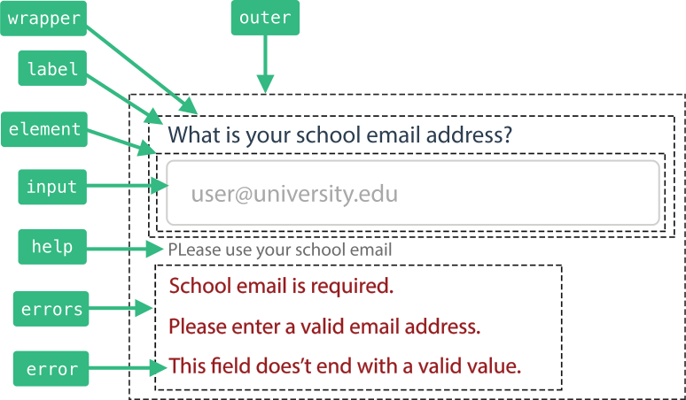

# 定制 class
<div id="customizing-classes"></div>

<ArticleCard
  href="https://dev.to/justinschroeder/tailwind-vue-formulate-24k1"
  badge="Article"
  headline="Using Tailwind with Vue Formulate 2.4"
  copy="Using the newly customizable classes in Vue Formulate, learn how to leverage the Tailwind CSS utility framework to quickly add custom styling to your forms."
  :sidebar="true"
/>

有 4 种方法可以更改应用于 `FormulateInput` 中的 DOM 元素的类：

1. 在 `FormulateInput` 上设置 prop。
2. 全局使用 `classes` 选项。
3. 全局使用 `baseClasses` 选项。
3. 使用 [插槽](/zh/guide/inputs/slots/) 手动覆盖 DOM。

在前两种情况下，你可以使用 `string`, `array` 或 `function` 来定义哪些 class 应应用于处于给定状态（比如：有验证错误时）的
给定元素（比如：`label`），每个元素和状态都由 [类键](#class-keys) 标识。

## 用 props 改变 class

更改给定表单域的 class 很容易。只需使用一个名为 `[element class key]-class` 的 prop 将要更改的类键作为目标。
要以状态为目标，请使用 `[element class key]-[state class key]-class`。

### 字符串 (用于替换基础 class)
使用 `string` class prop 中的值 **替换** 任何基础 class。

```vue
<FormulateInput
  label="The label is using its own class"
  label-class="my-label-class"
/>
<!-- <label class="my-label-class"> -->
```

### 数组 (附加到基础 class)

要将类附加到基础 class 中，请在您的类 prop 中使用一个 `array` 。

```vue
<FormulateInput
  label="The input wrapping div is using its own class"
  :wrapper-class="['my-wrapper-class']"
/>
<!-- <div class="formulate-input-wrapper my-wrapper-class" /> -->
```

### 函数

对于细粒度控制，您可以使用 `function`. 该函数将接收 2 个参数，
一个 [class 上下文对象](#class-context) 和一个使用全局选项生成的基础 class 数组。

```vue
<FormulateInput
  label="The element div is using its own class"
  :element-class="(context, classes) => ['my-element-class'].concat(classes)"
/>
<!-- <div class="my-element-class formulate-input-element formulate-input-element--text" /> -->
```


## 全局更改 class

要全局更新默认情况下应用于 _每个_ `FormulateInput` 的类，你可以使用 [class 键](#class-keys) 的对象更新 classes 选项。

类似于使用 prop 修改， `class` 选项可以使用 `string`, `array` 或函数。字符串用于 _覆盖_ 基础 class。
数组用于附加样式。函数允许细粒度控制并且可以分别接受一个上下文和 `baseClasses` 参数。

### 字符串
```js
import Vue from 'vue'
import VueFormulate from 'vue-formulate'

Vue.use(VueFormulate, {
  classes: {
    outer: 'mytheme-wrapper',
  }
})
// All <FormulateInput> will output:
// <div class="mytheme-wrapper">...
```

### 数组
```js
...
Vue.use(VueFormulate, {
  classes: {
    outer: ['mytheme-wrapper'],
  }
})
// All <FormulateInput> will output:
// <div class="formulate-input mytheme-wrapper">...
```

### 函数
```js
...
Vue.use(VueFormulate, {
  classes: {
    outer: (context, classes) => {
      return classes.concat([
        'mytheme-wrapper',
        `mytheme-wrapper--${context.type}`
      ])
    },
  }
})
// All <FormulateInput> will output:
// <div class="formulate-input mytheme-wrapper mytheme-wrapper--[type]">...
```

## 自定义 `baseClasses` 函数

对于高级用例，您还可以选择通过设置 `options.baseClasses` 为您自己的函数来覆盖基类。
该功能将被应用到每一个 `FormulateInput` 中的每个类键上。例如，如果你想在 Vue Formulate 中执行所有类的重置，
你可以返回一个空数组：


```js
Vue.use(VueFormulate, {
  baseClasses: (baseClasses, context) => []
})
```

## 类键
<div id="class-keys"></div>

在 DOM 元素操控类需要针对其要添加/删除类的元素。
为了实现精确的类定位，每个 DOM 元素都分配了一个 “元素键”，可用于 [自定义类](#customizing-classes)。

除了 “元素键”，Vue Formulate 还包括 “状态键”，
用于描述表单域的特定状态。例如 `hasErrors`，当前显示错误的输入的状态键。
用 “状态键” 定义的类是可添加的，它们不会替换任何基类。

### 元素键

#### 针对表单域

键             | 默认值                          | 说明
----------------|----------------------------------|---------------------------------------------------
`outer`         | `.formulate-input`               | 最外面的 div 包裹器。
`wrapper`       | `.formulate-input-wrapper`       | 标签和内部元素的包裹器。
`label`         | `.formulate-input-label`<br>`.formulate-input-label--[position]` | 标签包裹器及其位置（之前/之后）。
`element`       | `.formulate-input-element`<br>`.formulate-input-element--[type]` | 实际 `<input>` 元素周围的包裹器。
`input`         | n/a                              | 直接应用于输入 DOM 元素。默认情况下不使用以允许更灵活的级联。
`help`          | `.formulate-input-help`<br>`.formulate-input-help--[position]` | 包裹帮助文本。
`errors`        | `.formulate-input-errors`        | 包裹错误列表。
`error`         | `.formulate-input-error`         | 包裹单个错误消息。



一些表单域类型有额外的类键，在它们自己的页面上有详细说明：

- [box](/zh/guide/inputs/types/box/#custom-class-keys)
- [滑块](/zh/guide/inputs/types/sliders/#custom-class-keys)
- [文件](/zh/guide/inputs/types/file/#custom-class-keys)
- [分组](/zh/guide/inputs/types/group/#custom-class-keys)

#### 针对表单

键             | 默认值                          | 说明
----------------|----------------------------------|---------------------------------------------------
`form`          | `.formulate-form`                | `FormulateForm` 的 `form` 元素
`form-errors`   | `.formulate-form-errors`         | `FormulateErrors` 组件的 `ul` 列表
`form-error`    | `.formulate-form-error`          | `FormulateErrors` 组件的列表的 `li` 元素

:::warning 重要提示
当使用 props 更改表单错误的类时，
必须将 props 放在 `FormulateForm` 组件上。切勿直接在 `FormulateErrors` 组件上使用类键。
:::

### 状态键

状态键可以很容易地为给定的表单域状态添加一个类，比如当一个字段有一个值时。**状态键必须始终与元素键组合在一起。**

键             | 说明
----------------|---------------------------------------------------------------
`hasErrors`     | For inputs, when the input is visibly _showing_ errors (if the `error-behavior` is not `live` this will be `false` until the errors are shown). For forms, `hasErrors` is true if any of it’s inputs are not valid irregardless of their visibility.
`hasValue`      | 表单域有一个值
`isValid`       | 无论可见性如何，表单域都 _没有错误_。

:::tip
您可以通过使用元素键的函数并根据 `context` 中提供的状态附加一些值来获得与状态键相同的结果。
这些状态键是获得相同结果的有用快捷方式。
:::

#### 全局

要全局定义状态键，请与元素键使用驼峰式风格结合起来。

```js
Vue.use(VueFormulate, {
  classes: {
    labelHasValue: 'has-value'
  }
})
```

#### 通过 props

要通过 props 使用状态类键，请将其与元素键 (kebab case) 结合使用 `[element key]-[state-key]-class`。
例如，要在有效字段的标签上添加对号：

```vue
<FormulateInput
  label="Social Security Number"
  placeholder="xxx-xx-xxx"
  help="Please enter your social security number: XXX-XX-XXXX"
  value="332-22-9982"
  :validation="[
    ['required'],
    ['matches', /^\d{3}\-\d{2}\-\d{4}$/]
  ]"
  label-is-valid-class="my-valid-class"
/>
```

<demo-state-class-key />

## Class 上下文
<div id="class-context"></div>

全局类函数和 prop 类函数都接收具有以下值的 “class 上下文”：

#### 对于表单域

Property          | 说明
------------------|----------------------------------------------------------------
`attrs`           | 应用于表单域的属性（例如 `disabled`）
`classification`  | 表单域的 classification (例如 `text`, `group`, `select`)
`hasErrors`       | `Boolean` 指示 _可见_ 错误。
`hasValue`        | `Boolean` 指示该字段是否具有值。
`helpPosition`    | `String` 描述帮助文本的位置。`before` 或 `after`.
`isValid`         | `Boolean` 指示该字段是否无错误，无论错误可见性如何。
`labelPosition`   | `String` 描述标签的位置。`before` 或 `after`.
`type`            | 表单域的 `type`
`value`           | 表单域的值

#### 对于表单

Property          | 说明
------------------|----------------------------------------------------------------
`attrs`           | 应用于表单的属性
`classification`  | 总是 `form`
`errors`          | 来自错误处理或 `invalid-message` prop 的表单错误
`hasErrors`       | `Boolean` 说明不是所有的字段都有效（并 _没有_ 考虑表单域的类上下文可见性）。
`isLoading`       | 表单的加载状态 (当在 `@submit` 函数中使用 `Promise` 时)
`isValid`         | `hasErrors` 的倒数
`type`            | 总是 `form`.
`value`           | 表单模型的值
